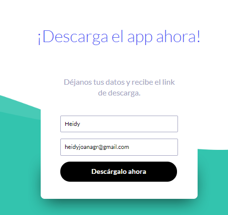
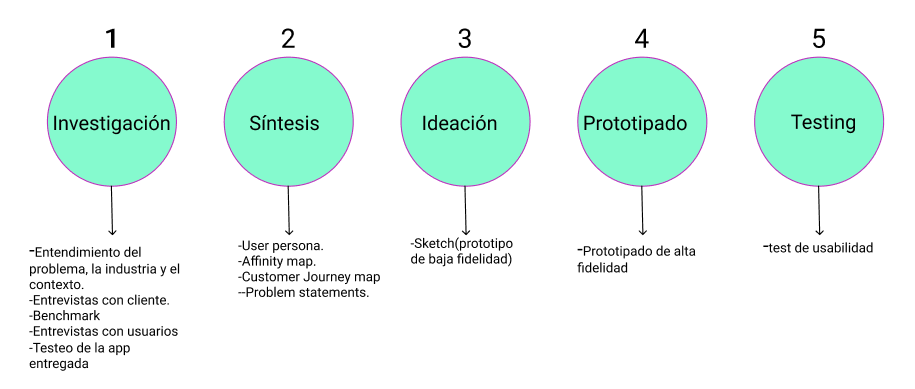

# Aplicación financiera

## I. Introducción

### 1. Preámbulo

La transformación digital esta en todos los  ámbitos  y el sector bancario no es la excepción, si estos  quieren ser exitosos y seguir existiendo deben incluirla .Los clientes ya acostumbrados a las  apps también esperan que sus bancos les brinden soluciones rápidas, eficientes y seguras.

Los bancos tienen que intentar adaptarse a las expectativas de los clientes creando cada vez mejores soluciones.

### 2. Contexto

Hace 6 meses que el  banco más importante del país ha lanzado una nueva aplicación móvil al mercado para que sus usuarios puedan visualizar sus gastos mensuales y fomentar el ahorro.En este tiempo la app ha tenido algo de tracción pero el banco desea que llegue a todo su potencial es por eso que el equipo detrás de este producto   han decidido contratarnos como UX para que los ayudemos a definir la dirección y evolución del producto

#### 2.1. MVP de Banco

El producto mínimo viable que el banco lanzó al mercado fue este:

### 2.2. Landing Page

Algunas partes de su landing page lucía así:

### 3. Rediseño UX

## II. Research

Objetivos iniciales del proyecto

- Identificar si el user persona esta bien definido.
- Analizar la data entregada por el cliente.
- Identificar posibles problemas dentro de la app.

*Que la app fomente el ahorro.Que el valor agregado no sea simplemente voy a poner el 10%
en esta cuenta y ya el valor agregado seria ligarlo con algun deseo,alguna meta,algo que
concretice mas y que ayude a que ellos hagan eso.Queremos que la app haga eso.

////////////////////////////////////////////////////////////////
## Preámbulo

El banco más importante del país ha lanzado una nueva aplicación móvil al
mercado para que sus usuarios puedan visualizar sus gastos mensuales y fomentar
el ahorro. Luego de tener algunos meses en el mercado y algo de tracción, el
equipo detrás de este nuevo producto ha decidido contratar a una
agencia/consultora de UX que los ayude a definir la dirección y evolución del
producto. Tú y otra compañera de Laboratoria trabajan en la agencia/consultora
de UX y son asignadas al proyecto.

## Introducción

### Contexto

Durante la primera semana de entendimiento de los requerimientos, el Product
Manager del equipo les brinda el contexto:

>“Todo empezó hace un año cuando vimos que en EEUU y Europa estaban saliendo
  nuevas aplicaciones financieras que nos llamaron la atención. Unas se enfocan
  en darle visibilidad a sus usuarios sobre los gastos, otras en facilitar pagos
  a terceros y otras a fomentar el ahorro. Inspirados en un par de ellas,
  decidimos lanzar una nueva aplicación. Decidimos que era mejor crear un
  producto desde cero - en lugar de modificar la aplicación actual de banca
  móvil - para poder desarrollarla con un equipo totalmente nuevo, en el
  laboratorio de innovación, bajo prácticas ágiles. Sabemos que no es ideal que
  nuestros usuarios tengan que usar dos aplicaciones, pero desarrollar con un
  equipo nuevo que corra ágil nos da mayor libertad.

> Empezamos entrevistando a algunos usuarios y revisando los resultados de un
  estudio de mercado que nos proporcionó el área de marketing. Eso nos dió una
  idea inicial de qué funcionalidades son más relevantes aquí en nuestro
  mercado. Con base en esos resultados, creamos nuestros primeros user personas
  una primaria y una secundaria ( creemos que estas personas no son las que
  nosotros pensábamos inicialmente), y diseñamos y desarrollamos un ‘Producto
  mínimo viable’ (MVP) en 2 meses en iOS. Ese MVP lo hemos lanzado y tenemos
  alrededor de 6 meses de data. Hoy estamos en el proceso de entender los
  resultados iniciales y de sacar una segunda iteración del producto. Y para eso
  las hemos contratado. Toda la documentación de este producto la tenemos en una
  carpeta de [Google Drive](http://bit.ly/uxd-reto-2). Les doy acceso.

> Necesitamos traer una propuesta del nuevo diseño en dos semanas porque tenemos
  que presentarla a nuestro Gerente General en la reunión trimestral. Es
  importante que cualquier cosa que presentemos ya incorpore feedback de testing
  con usuarios. El Gerente General, animado por el crecimiento del número de
  descargas que ha tenido el app, quiere duplicar el presupuesto de Facebook
  Ads… Yo no estoy tan seguro; quisiera que como parte de su trabajo estas
  próximas dos semanas, entendamos ese punto también.”

### Recursos

En esta carpeta de [Google Drive](http://bit.ly/uxd-reto-2) y en los siguientes
links, encontrarán:

- Los user persona primario y secundario del proyecto
- Los user flows iniciales y actuales del proyecto del MVP
- El [diseño del app en Figma](https://www.figma.com/file/Gr5GEIRrjF9eIplIeEHUSJNt/proyecto-2-banca?node-id=0%3A477)
  , con una guía de componentes y el [Prototipo navegable](https://marvelapp.com/e9h245e)
- Funnel Analytics de los primeros 6 meses del MVP
- Data de uso del MVP de los primeros 6 meses
- [Landing Page](http://tus-finanzas.pagedemo.co) inicial del producto

## Objetivos de aprendizaje

El objetivo principal de este proyecto es que te enfrentes al reto de rediseñar
un producto ya existente. Muchas de ustedes terminarán trabajando en productos
existentes y deben estar familiarizadas con el proceso de analizar la data del
producto, complementar con investigación de campo y con esto definir una
estrategia de crecimiento del producto. Puedes leer sobre el trabajo de un
UX Designer en rediseño este [blogpost](https://blog.continuum.cl/preguntas-para-dejar-de-ser-ux-designer-y-empezar-a-ser-un-ux-redesigner-143e5467ec8d).

En este proyecto pondrás en práctica habilidades de: análisis de datos,
investigación de campo, pensamiento crítico, cuestionamiento, síntesis, diseño
de componentes de la interfaz y user testing.

## Consideraciones generales

Como ya habrás notado, gran parte del trabajo de UX tiene relación con el
desempeño de tus habilidades blandas. Estas habilidades nos acompañan a lo largo
de cualquier proyecto y su desarrollo es clave para el éxito. Estas habilidades
no sólo son utilizadas a la hora de entender al usuario, sino a lo largo de toda
la ejecución, es decir desde cómo planificamos hasta nuestra presentación al
cliente.

Anteriormente, nos habíamos concentrado en el desarrollo de tu curiosidad y
empatía, practicado cómo relacionarte con el cliente y el usuario. Siempre debes
pensar quiénes son y qué necesitan, y no enfocarte en lo que tú consideras que
podría ser la solución correcta. Se trata de entender que nosotros no somos el
usuario, y debemos hacer el ejercicio empático de comprenderlo a él y a nuestro
cliente.

Este proyecto, a diferencia de otros, no debes partir desde cero generando un
prototipo, sino investigar lo que el banco ya ha construido y en base a eso
proponer un nueva alternativa. Para esto, te aconsejamos comenzar por investigar
la información que tienes; entender qué datos ya manejas y qué elementos
necesitas averiguar para completar tu proyecto. De esta manera, tu planificación
es muy relevante para comprender la problemática.

Al planificar podrás comprender de qué manera estructurar tu proyecto y qué
elementos debes investigar. Además, te permitirá trabajar de mejor manera con tu
compañera, te aconsejamos que consideres tiempo para poder iterar sobre las
posibilidades de mejora y también para preparar la presentación.

La calidad del proyecto depende totalmente de tu proactividad y autoaprendizaje,
si no conoces plataformas financieras parte por investigar sobre ellas. No
esperes que los contenidos lleguen a ti, más bien busca todo lo que necesites
para poder encontrar la mejor solución.

Parte importante de tu trabajo como UX designer es tomar decisiones.
Efectivamente existen múltiples herramientas que puedes utilizar, debes
comprender para qué y con qué finalidad escoges usar cada una de ellas. Siempre
piensa que debes justificar todo gasto con tu consultora y con el cliente, cada
decisión que tomes en el proyecto debe ser fundamentada, no sigas pasos
mecánicos por seguirlos, cuestiónate constantemente.

Por último, considera que la calidad de tu presentación es tan importante como
el proceso completo. Un proyecto que no se aprecia al ser presentado no es un
buen proyecto. Si vas a utilizar una ppt frente a un cliente, se prolija en el
diseño de tus láminas y en la información que entregas, también busca la mejor
manera de mostrar tu demo y por sobre todo prueba antes de presentar frente al
cliente. En la presentación no deben ocurrir errores.

## Entrega

El proyecto será entregado en un repositorio de GitHub. En él deberás agregar
lo siguiente:

README.md  detallando:

* Objetivos iniciales del proyecto
* Problemas encontrados tanto a nivel de negocio como a nivel de usuario
* Recomendaciones de próximos pasos para el banco con respecto al app (estas
  recomendaciones tendrán que ser sustentadas por tu investigación):
  * Qué modificaciones se deberían hacer
  * Cuáles deberían ser los próximos desarrollos
  * En qué se debería invertir el presupuesto de marketing
* De acuerdo al punto anterior, de requerirse cambios y desarrollos nuevos,
  estos deberán ser diseñados y entregados en un prototipo de alta definición.
* Link de Zeplin, InVision inspects o Marvel Hand-offs para compartir tus
  diseños con desarrolladores

Un video en Loom de máximo 5 minutos explicando tu documento.
* Estos 5 minutos tienes que utilizarlos para explicar los puntos indicados en
  el `README.md` y para hacer un demo de la solución propuesta.

En las otras carpetas del repositorio o en las carpetas de Google Drive podrás
agregar los documentos complementarios que sustenten tu proceso.

### Hacker edition

Para el hacker edition puedes elegir una o varias de estas opciones:

- Antes de empezar a desarrollar este proyecto, lista cuáles fueron tus
  aprendizajes durante el proyecto 1 y en qué cosas te gustaría mejorar durante
  el proyecto 2. Al terminar el proyecto 2 vuelve a esta lista y chequea cómo te
  fue con esos retos, ¿los cumpliste? Muestrános esta lista y esta reflexión
  en un documento adicional (en el formato que prefieras).
- Investiga sobre chatbots y sustenta si sería bueno incluir uno en alguna parte
  del journey del uso del producto. Si crees que un chatbot añadiría valor,
  prototípalo usando [Botsociety](http://bit.ly/ux-chatbot).
- Adapta el diseño del app para iPhone X/XS/XR.
- Diseña un app para Apple Watch que complemente tu propuesta.
- En lugar de usar Github para documentar tu proceso de trabajo, documéntalo en
  su propia web, puedes usar Wix, Instapage, Squarespace, Google Sites o crear
  tu propia web desde 0.
- Escribe un post en Medium contando tu proceso de investigación.
- Crea un video mostrando el demo del app, aquí algunos ejemplos:
  - [Nequi](https://www.youtube.com/watch?v=BDLAXvSQCZ8)
  - [Simple Bank](https://www.youtube.com/watch?v=0eqD5o6422M)
  - [Pocket](https://www.youtube.com/watch?v=MoJHYNKmS2U)
  - [Hip Money](https://www.youtube.com/watch?v=BIesWRESgAc)

## Otras consideraciones

### 1) Planeamiento y presupuesto

En el reto del marketplace te entregamos una lista de tareas que podías
realizar y le asignamos un valor en puntos a cada tarea. Además, te dimos un
presupuesto de 300 puntos para que los utilices en esas tareas. Para este reto,
la lista de tareas, el valor en puntos de cada tarea y el presupuesto total
de las actividades a realizar lo crearás tú y lo tendrás que sustentar con tu
coach. Adicionalmente, deberás sustentar con tu coach qué entregables harás
llegar al banco al final de tu investigación y por qué. El coach te aprobará
estos entregables o te dará feedback para mejorarlos.

Cuando hagas tu presupuesto y pienses en los entregables recuerda que el tiempo
de desarrollo de este proyecto es de dos semanas. También, recuerda qué partes
te tomaron más tiempo en el desarrollo del proyecto 1 y los aprendizajes que
tuviste al desarrollar el proyecto 1.

### 2) Prototipo de alta fidelidad

Existen varias herramientas que puedes utilizar para diseñar el producto,
en este caso el diseño viene en Figma y el prototipo en Marvel, así que puedes
seguir usando esas herramientas. Sin embargo, eres libre de utilizar otras
como Adobe XD e Invision. Para el prototipo intenta utilizar Marvel o Invision,
ya que para el testing tendrás que usar una herramienta llamada
[Maze](https://maze.design/) que funciona mejor con estas.

Recuerda que el diseño que trabajes debe seguir los fundamentos de diseño visual
como: contraste, alineación, jerarquía, entre otros.
